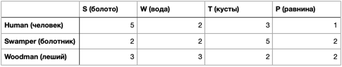

##SWTP project

-------
В данном проекте представлен результат выполнения тестового задания.

Условия задания:
1) Необходимо создать метод на вход которого приходят следующие параметры:
   - строка, длинной 16 символов, описывающая клетки игрового поля 4*4;
   - строка, содержащая расу существа.
2) Данный метод должен возвращать минимальные затраты существа на перемещения 
из стартовой позиции (левый верхний угол) в конечную (правый нижний угол).
3) Перемещения происходят по следующим правилам:
   - существо может перемещаться только вверх/вниз и влево/вправо;
   - стоимость перемещения по клеткам зависит от типа клетки и от расы существа 
   в соответствии с таблицей ниже.
   
      

---
###Пример:
 - Входные данные: "STWSWTPPTPTTPWPP", "Human";
 - Выходные данные: 10.

В таблице приведена возможная интерпретация входных данных. 
Синие клетки - это стартовая и конечная позиции. Зеленым обозначен 
один из оптимальных маршрутов. 

Сигнатура метода: Предполагается, что будет существовать класс Solution 
с единственным публичным, статическим методом с именем getResult.

---

##Реализация:
1) В первом коммите (Initial commit) реализованы вышеперечисленные условия;
2) Во втором коммите (Added function for info from json file.) реализован пункт 
со звёздочкой (Программа не должна содержать никакой информации о названиях существ,
названиях препятствий и стоимости перемещений. Все эти данные должны считываться из файла.)
Файл решено было взять в json формате. В корне проекта есть тестовый вариант 
под названием info.json
